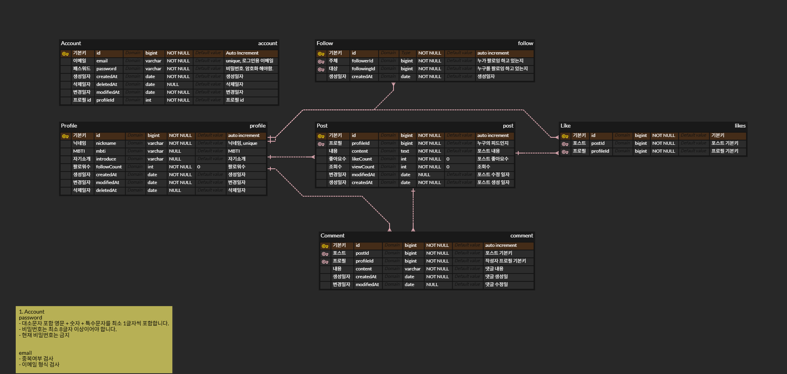

# 🌟 News Feed - 현대적이고 확장 가능한 소셜 미디어 플랫폼

> **Spring Boot 3.5 기반으로 구축된, 사용자 중심의 뉴스피드 백엔드 서비스**  
> 이 프로젝트는 실시간 소셜 인터랙션과 견고한 보안을 제공하며, 클린 아키텍처를 통해 높은 확장성과 유지보수성을 자랑합니다.


---

<!-- 추가: ERD 다이어그램 (가운데 정렬, 반응형) -->
<figure style="text-align:center;margin:24px 0;">
  <a href="erd.png" title="ERD (Click to open)">
    
  </a>
  <figcaption style="font-size:0.95rem;color:#555;margin-top:8px;">
    ERD (Entity Relationship Diagram) — 주요 엔티티와 관계도.
  </figcaption>
</figure>

## 📖 목차

-   [🌟 News Feed - 현대적이고 확장 가능한 소셜 미디어 플랫폼](#-news-feed---현대적이고-확장-가능한-소셜-미디어-플랫폼)
-   [✨ 주요 특징](#-주요-특징)
    -   [🎯 완벽한 소셜 미디어 경험](#-완벽한-소셜-미디어-경험)
    -   [🔒 엔터프라이즈급 보안](#-엔터프라이즈급-보안)
    -   [🏗️ 클린 아키텍처](#️-클린-아키텍처)
-   [📋 기능 목록](#-기능-목록)
    -   [👤 사용자 관리](#-사용자-관리)
    -   [📝 포스트 관리](#-포스트-관리)
    -   [💬 댓글 시스템](#-댓글-시스템)
    -   [👥 소셜 기능](#-소셜-기능)
    -   [📰 뉴스피드](#-뉴스피드)
-   [🛠️ 기술 스택](#️-기술-스택)
    -   [Backend Core](#backend-core)
    -   [Security & Authentication](#security--authentication)
    -   [Database](#database)
    -   [Build & Test](#build--test)
    -   [Validation & Utilities](#validation--utilities)
-   [🚀 빠른 시작](#-빠른-시작)
    -   [사전 요구사항](#사전-요구사항)
    -   [프로젝트 실행](#프로젝트-실행)
-   [📡 API 엔드포인트](#-api-엔드포인트)
    -   [🔐 인증 (Authentication)](#-인증-authentication)
    -   [📝 포스트 (Posts)](#-포스트-posts)
    -   [👤 프로필 (Profile)](#-프로필-profile)
    -   [💬 댓글 (Comments)](#-댓글-comments)
    -   [👥 소셜 인터랙션](#-소셜-인터랙션)
    -   [📰 피드 (Feed)](#-피드-feed)
-   [🏗️ 프로젝트 구조](#️-프로젝트-구조)
    -   [아키텍처 특징](#아키텍처-특징)
-   [🧪 테스트](#-테스트)
    -   [테스트 구조](#테스트-구조)
-   [🎨 API 응답 형식](#-api-응답-형식)
    -   [에러 응답 예시](#에러-응답-예시)
-   [🔧 환경 설정](#-환경-설정)
    -   [개발 환경](#개발-환경)
    -   [테스트 환경](#테스트-환경)
-   [🌟 핵심 설계 원칙](#-핵심-설계-원칙)
    -   [1. 도메인 주도 설계](#1-도메인-주도-설계)
    -   [2. 확장 가능한 아키텍처](#2-확장-가능한-아키텍처)
    -   [3. 보안 우선](#3-보안-우선)
    -   [4. 테스트 주도](#4-테스트-주도)
-   [🤝 기여](#-기여)
-   [📄 라이선스](#-라이선스)
-   [📞 문의](#-문의)

---

## ✨ 주요 특징

News Feed는 현대적인 소셜 미디어 플랫폼의 핵심 기능을 모두 갖춘 완성도 높은 백엔드 서비스입니다. 확장성과 유지보수성을 고려한 설계로, 실제 프로덕션 환경에서도 안정적으로 운영할 수 있습니다.

### 🎯 **완벽한 소셜 미디어 경험**
-   **실시간 뉴스피드**: 팔로우한 사용자들의 최신 포스트를 시간순으로 정렬하여 제공합니다.
-   **개인화된 프로필**: MBTI, 자기소개 등 사용자의 개성을 자유롭게 표현할 수 있는 유연한 프로필 시스템을 지원합니다.
-   **소셜 인터랙션**: 좋아요, 팔로우, 댓글 기능을 통해 사용자 간의 활발한 커뮤니케이션을 촉진합니다.

### 🔒 **엔터프라이즈급 보안**
-   **JWT 기반 인증**: 확장 가능하고 Stateless한 JSON Web Token (JWT) 기반의 인증 시스템을 구현하여 안전한 API 통신을 보장합니다.
-   **토큰 블랙리스트**: 로그아웃된 토큰을 즉시 무효화하는 블랙리스트 기능을 통해 보안을 강화합니다.
-   **비밀번호 암호화**: 강력한 BCrypt 해싱 알고리즘을 사용하여 사용자 비밀번호를 안전하게 저장합니다.

### 🏗️ **클린 아키텍처**
-   **도메인 주도 설계(DDD)**: 비즈니스 로직을 도메인 중심으로 명확하게 분리하여 복잡성을 관리하고, 개발 효율성을 높입니다.
-   **계층형 아키텍처**: `Controller` → `Service` → `Repository` 구조의 명확한 계층 분리를 통해 코드의 응집도를 높이고 결합도를 낮춥니다.
-   **SOLID 원칙**: 객체 지향 설계의 SOLID 원칙을 준수하여 유지보수성, 확장성, 유연성을 극대화합니다.

---

## 📋 기능 목록

현재 구현된 주요 기능들은 다음과 같습니다:

### 👤 **사용자 관리**
-   [x] 회원가입 / 로그인 / 로그아웃
-   [x] 비밀번호 변경
-   [x] 회원 탈퇴 (Soft Delete)
-   [x] 프로필 생성 및 수정
-   [x] 프로필 조회 (본인/타인)

### 📝 **포스트 관리**
-   [x] 포스트 작성 / 수정 / 삭제
-   [x] 포스트 조회 (조회수 자동 증가)
-   [x] 좋아요 / 좋아요 취소

### 💬 **댓글 시스템**
-   [x] 댓글 작성 / 수정 / 삭제
-   [x] 포스트별 댓글 목록 조회

### 👥 **소셜 기능**
-   [x] 팔로우 / 언팔로우
-   [x] 팔로잉 목록 조회
-   [x] 팔로우 상태 확인

### 📰 **뉴스피드**
-   [x] 전체 포스트 피드 (페이지네이션 지원)
-   [x] 팔로우한 사용자 포스트 피드
-   [x] 특정 사용자의 포스트 모음
-   [x] 기간별 피드 조회 (시작일 및 종료일 필터링)

---

## 🛠️ 기술 스택

프로젝트는 다음과 같은 최신 기술 스택을 활용하여 개발되었습니다.

### **Backend Core**
-   **Java 17** - 최신 LTS(Long Term Support) 버전으로, 성능과 안정성을 확보합니다.
-   **Spring Boot 3.5.4** - 빠르고 쉽게 독립 실행형, 프로덕션 등급의 Spring 기반 애플리케이션을 만들 수 있는 현대적인 웹 프레임워크입니다.
-   **Spring Data JPA** - Java Persistence API를 기반으로 데이터 액세스 계층을 효율적으로 구현하고, 객체 관계 매핑(ORM)을 지원합니다.

### **Security & Authentication**
-   **JWT (Auth0)** - 토큰 기반 인증을 위한 표준으로, 확장 가능하고 안전한 인증 메커니즘을 제공합니다.
-   **BCrypt** - 강력한 단방향 해싱 함수로, 사용자 비밀번호를 안전하게 암호화하여 저장합니다.

### **Database**
-   **MySQL** - 안정적이고 널리 사용되는 관계형 데이터베이스 관리 시스템으로, 프로덕션 환경에 적합합니다.
-   **H2** - 경량 인메모리 데이터베이스로, 개발 및 테스트 환경에서 빠른 데이터 처리를 위해 사용됩니다.

### **Build & Test**
-   **Gradle** - 유연하고 강력한 빌드 자동화 도구로, 의존성 관리 및 프로젝트 빌드를 효율적으로 수행합니다.
-   **JUnit 5** - Java를 위한 최신 테스트 프레임워크로, 단위 테스트 및 통합 테스트를 작성하는 데 사용됩니다.
-   **TestRestTemplate** - Spring Boot 애플리케이션의 E2E(End-to-End) 테스트를 위한 유틸리티로, 실제 HTTP 요청을 시뮬레이션합니다.

### **Validation & Utilities**
-   **Spring Validation** - Spring 프레임워크에서 제공하는 강력한 입력값 검증 기능으로, 데이터 무결성을 보장합니다.
-   **Lombok** - Java 개발 시 반복적인 코드를 줄여주는 라이브러리로, Getter, Setter, 생성자 등을 자동으로 생성하여 코드 가독성을 높입니다.

---

## 🚀 빠른 시작

프로젝트를 로컬 환경에서 실행하기 위한 단계별 가이드입니다.

### **사전 요구사항**
-   Java Development Kit (JDK) 17 이상
-   MySQL 8.0 이상 (프로덕션 환경 구성 시)

### **프로젝트 실행**

```bash
# 1. 프로젝트 클론
git clone https://github.com/n-factorial/news-feed.git # 실제 레포지토리 URL로 변경해주세요.
cd news-feed

# 2. 의존성 설치 및 빌드
./gradlew build

# 3. 애플리케이션 실행
./gradlew bootRun
```

서버가 성공적으로 시작되면 `http://localhost:8080`에서 API를 사용할 수 있습니다.

---

## 📡 API 엔드포인트

News Feed 백엔드 서비스에서 제공하는 주요 API 엔드포인트 목록입니다. 모든 API는 일관된 RESTful 원칙을 따릅니다.

### **🔐 인증 (Authentication)**
| HTTP Method | Endpoint                  | Description      |
| :---------- | :------------------------ | :--------------- |
| `POST`      | `/api/v1/auth/signup`     | 회원가입         |
| `POST`      | `/api/v1/auth/login`      | 로그인           |
| `POST`      | `/api/v1/auth/logout`     | 로그아웃         |
| `POST`      | `/api/v1/auth/withdraw`   | 회원탈퇴         |
| `PATCH`     | `/api/v1/auth/me/password`| 비밀번호 변경    |

### **📝 포스트 (Posts)**
| HTTP Method | Endpoint                  | Description      |
| :---------- | :------------------------ | :--------------- |
| `POST`      | `/api/v1/posts`           | 포스트 작성      |
| `GET`       | `/api/v1/posts/{postId}`  | 포스트 조회      |
| `PATCH`     | `/api/v1/posts/{postId}`  | 포스트 수정      |
| `DELETE`    | `/api/v1/posts/{postId}`  | 포스트 삭제      |

### **👤 프로필 (Profile)**
| HTTP Method | Endpoint                      | Description      |
| :---------- | :---------------------------- | :--------------- |
| `GET`       | `/api/v1/profiles/{id}`       | 프로필 조회      |
| `PUT`       | `/api/v1/profiles/me`         | 내 프로필 수정   |

### **💬 댓글 (Comments)**
| HTTP Method | Endpoint                          | Description      |
| :---------- | :-------------------------------- | :--------------- |
| `POST`      | `/api/v1/posts/{postId}/comments` | 댓글 작성        |
| `GET`       | `/api/v1/posts/{postId}/comments` | 댓글 목록 조회   |
| `PATCH`     | `/api/v1/comments/{commentId}`    | 댓글 수정        |
| `DELETE`    | `/api/v1/comments/{commentId}`    | 댓글 삭제        |

### **👥 소셜 인터랙션**
| HTTP Method | Endpoint                                  | Description      |
| :---------- | :---------------------------------------- | :--------------- |
| `POST`      | `/api/v1/posts/{postId}/likes`            | 좋아요           |
| `DELETE`    | `/api/v1/posts/{postId}/likes`            | 좋아요 취소      |
| `POST`      | `/api/v1/profiles/{profileId}/follows`    | 팔로우           |
| `DELETE`    | `/api/v1/profiles/{profileId}/follows`    | 언팔로우         |
| `GET`       | `/api/v1/profiles/{profileId}/followed`   | 팔로우 상태 확인 |
| `GET`       | `/api/v1/profiles/{profileId}/followings` | 팔로잉 목록      |
| `GET`       | `/api/v1/profiles/me/followings`          | 내 팔로잉 목록   |

### **📰 피드 (Feed)**
| HTTP Method | Endpoint                                  | Description                               |
| :---------- | :---------------------------------------- | :---------------------------------------- |
| `GET`       | `/api/v1/feeds`                           | 전체 피드 (옵션: `startDate=YYYY-MM-DD`, `endDate=YYYY-MM-DD`) |
| `GET`       | `/api/v1/feeds/following`                 | 팔로잉 피드 (옵션: `startDate=YYYY-MM-DD`, `endDate=YYYY-MM-DD`) |
| `GET`       | `/api/v1/profiles/{profileId}/feeds`      | 특정 사용자 피드 (옵션: `startDate=YYYY-MM-DD`, `endDate=YYYY-MM-DD`) |

---

## 🏗️ 프로젝트 구조

프로젝트는 클린 아키텍처 원칙을 기반으로 모듈화되어 있으며, 각 도메인이 독립적으로 관리됩니다.

```
src/main/java/org/nfactorial/newsfeed/
├── 📁 common/                  # 공통 기능 (설정, DTO, 예외 처리, 보안 등)
│   ├── 📁 config/             # Spring 설정 클래스
│   ├── 📁 dto/                # 공통 응답 DTO
│   ├── 📁 entity/             # 기본 엔티티 (BaseTimeEntity 등)
│   ├── 📁 exception/          # 전역 예외 처리 핸들러
│   └── 📁 security/           # JWT 기반 보안 관련 클래스
├── 📁 domain/                  # 핵심 비즈니스 도메인별 구현
│   ├── 📁 auth/               # 인증 및 계정 관리 (회원가입, 로그인 등)
│   ├── 📁 post/               # 포스트 생성, 조회, 수정, 삭제
│   ├── 📁 comment/            # 댓글 생성, 조회, 수정, 삭제
│   ├── 📁 commenting/         # 포스트에 대한 댓글 기능 통합
│   ├── 📁 feed/               # 뉴스피드 생성 및 조회 로직
│   ├── 📁 interaction/        # 좋아요 및 팔로우 기능
│   └── 📁 profile/            # 사용자 프로필 관리
```

### **아키텍처 특징**
-   **도메인별 패키지 분리**: 각 도메인(예: `auth`, `post`, `comment`)이 독립적인 패키지로 분리되어 있어, 코드의 응집도를 높이고 모듈성을 강화합니다.
-   **계층형 구조**: `controller` (API 엔드포인트), `service` (비즈니스 로직), `repository` (데이터 접근), `entity` (데이터 모델)의 명확한 계층 분리를 통해 역할과 책임을 명확히 합니다.
-   **DTO 패턴**: 요청(Request) 및 응답(Response) 객체를 엔티티와 분리하여, 데이터 전송 객체(DTO)를 통해 계층 간 데이터 교환을 안전하고 효율적으로 관리합니다.
-   **Global Exception Handling**: `@ControllerAdvice`를 활용한 전역 예외 처리 시스템을 구축하여, 모든 API 요청에 대해 일관된 에러 응답 형식을 제공합니다.

---

## 🧪 테스트

프로젝트는 높은 코드 품질과 안정성을 보장하기 위해 포괄적인 테스트 스위트를 포함합니다.

```bash
# 전체 테스트 실행
./gradlew test

# 특정 테스트 클래스 실행 (예: 인증 관련 E2E 테스트)
./gradlew test --tests "AuthE2ETest"
```

### **테스트 구조**
-   **E2E 테스트**: 실제 HTTP 요청을 시뮬레이션하여 시스템의 엔드-투-엔드 흐름을 검증하는 통합 테스트입니다.
-   **H2 인메모리 DB**: 테스트 실행 시 H2 인메모리 데이터베이스를 사용하여, 테스트 간의 격리성을 보장하고 실행 속도를 향상시킵니다.
-   **자동 데이터 정리**: 각 테스트 케이스 실행 후 데이터베이스를 자동으로 초기화하여, 테스트의 독립성과 재현 가능성을 보장합니다.

---

## 🎨 API 응답 형식

모든 API는 일관된 JSON 응답 형식을 사용하여 클라이언트와의 통신을 표준화합니다.

```json
{
  "code": "SUCC-200",
  "message": "요청 성공",
  "data": {
    // 실제 응답 데이터 (성공 시)
  }
}
```

### **에러 응답 예시**
오류 발생 시에는 다음과 같은 형식으로 응답합니다.

```json
{
  "code": "AUTH-401",
  "message": "인증이 필요합니다.",
  "data": null
}
```

---

## 🔧 환경 설정

프로젝트는 개발 및 테스트 환경에 따라 유연하게 설정할 수 있습니다.

### **개발 환경**
-   **프로필**: `dev` (Spring Profile)
-   **데이터베이스**: 개발용 MySQL 또는 H2 데이터베이스를 사용하도록 설정할 수 있습니다.

### **테스트 환경**
-   **데이터베이스**: H2 인메모리 데이터베이스를 사용합니다.
-   **DDL 설정**: `create-drop` DDL(Data Definition Language) 설정을 통해 각 테스트 실행 후 데이터베이스 스키마를 초기화하여 테스트 격리성을 확보합니다.

---

## 🌟 핵심 설계 원칙

News Feed 프로젝트는 다음과 같은 핵심 설계 원칙을 기반으로 구축되었습니다.

### **1. 도메인 주도 설계 (Domain-Driven Design)**
각 도메인은 독립적으로 관리되며, 비즈니스 로직이 명확하게 분리되어 있습니다. 이는 복잡한 비즈니스 요구사항을 효과적으로 모델링하고 관리하는 데 도움을 줍니다.

### **2. 확장 가능한 아키텍처 (Scalable Architecture)**
새로운 기능 추가나 요구사항 변경에 유연하게 대응할 수 있는 모듈화된 구조를 가지고 있습니다. 이는 장기적인 프로젝트 유지보수와 성장에 필수적입니다.

### **3. 보안 우선 (Security First)**
JWT 토큰 관리, 비밀번호 암호화, 토큰 블랙리스트 등 엔터프라이즈급 보안 기능을 구현하여 사용자 데이터를 안전하게 보호합니다.

---

## 🤝 기여

이 프로젝트에 기여하고 싶으시다면, 다음 가이드라인을 따라주세요:
1.  저장소를 포크(Fork)합니다.
2.  새로운 기능 또는 버그 수정을 위한 브랜치를 생성합니다 (`git checkout -b feature/your-feature-name`).
3.  변경 사항을 커밋하고 푸시합니다.
4.  Pull Request를 생성하여 변경 사항을 설명합니다.

---

## 📄 라이선스

이 프로젝트는 MIT 라이선스에 따라 배포됩니다. 자세한 내용은 [LICENSE](LICENSE) 파일을 참조하세요.

---

## 📞 문의

프로젝트에 대한 질문이나 제안이 있으시면, 다음 연락처로 문의해주세요:
-   **이메일**: [**박수현** 팀장님](mailto:sooh59599@gmail.com)
-   **GitHub Issues**: [Issues Page](https://github.com/n-factorial/news-feed/issues)

---

**News Feed**는 현대적인 소셜 미디어 플랫폼의 핵심 기능을 모두 갖춘 완성도 높은 백엔드 서비스입니다. 확장성과 유지보수성을 고려한 설계로, 실제 프로덕션 환경에서도 안정적으로 운영할 수 있습니다. 🚀